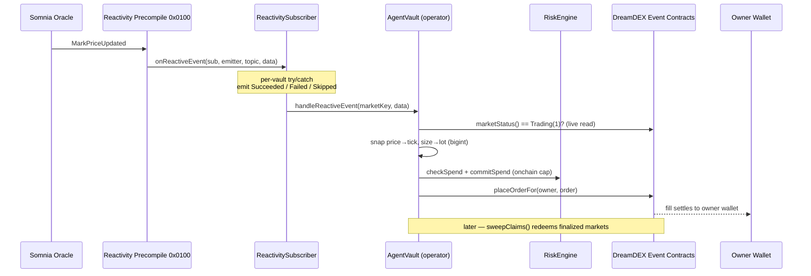
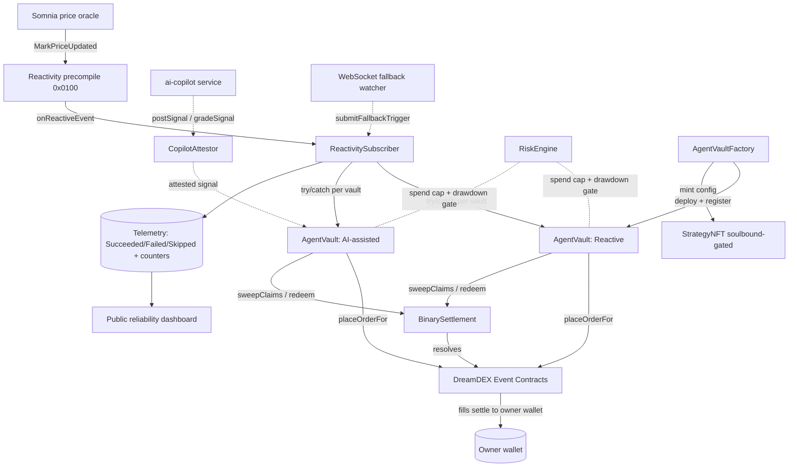

<div align="center">

# 🎼 Candence

### A fully onchain-reactive agent arena for [DreamDEX](https://dreamdex.io) Event Contracts on [Somnia](https://somnia.network)

**Strategy agents place directional calls the *instant* Somnia's Reactivity precompile (`0x0100`) delivers a price event — never on an offchain cron.**
The reactive path *is* the product. Everything else exists so a judge can verify that claim, block by block, on the explorer.

<br/>

[](./LICENSE)
[](https://docs.soliditylang.org/)
[](https://getfoundry.sh/)
[](https://nextjs.org/)
[](https://www.typescriptlang.org/)
[](https://viem.sh/)
[](https://pnpm.io/)
[](https://somnia.network/)

<br/>

[**Thesis**](#-the-thesis-why-candence-exists) · [**Features**](#-three-stacked-value-props) · [**Architecture**](#-architecture) · [**Quickstart**](#-quickstart) · [**Contracts**](#-smart-contract-suite) · [**Agent SDK**](#-the-agent-sdk--candenceagent-kit) · [**Dashboard**](#-telemetry--the-reliability-dashboard) · [**Docs**](#-documentation)

</div>

---

## 📖 Table of Contents

- [The Thesis — why Candence exists](#-the-thesis-why-candence-exists)
- [Three stacked value props](#-three-stacked-value-props)
- [How it works — the reactive flow](#-how-it-works--the-reactive-flow)
- [Architecture](#-architecture)
- [Repository structure](#-repository-structure)
- [Tech stack](#-tech-stack)
- [Quickstart](#-quickstart)
- [Environment configuration](#-environment-configuration)
- [Smart contract suite](#-smart-contract-suite)
- [The non-custodial operator model](#-the-non-custodial-operator-model)
- [The Agent SDK — `@candence/agent-kit`](#-the-agent-sdk--candenceagent-kit)
- [Operational services](#-operational-services)
- [Telemetry & the reliability dashboard](#-telemetry--the-reliability-dashboard)
- [Frontend — the consumer arena](#-frontend--the-consumer-arena)
- [Testing & verification](#-testing--verification)
- [SOMI / gas economics](#-somi--gas-economics)
- [Risk & safety controls](#-risk--safety-controls)
- [Network reference](#-network-reference)
- [Scripts reference](#-scripts-reference)
- [The non-negotiables](#-the-non-negotiables)
- [Sustainability & roadmap](#-sustainability--roadmap)
- [Documentation](#-documentation)
- [FAQ](#-faq)
- [Contributing](#-contributing)
- [License](#-license)

---

## 🎯 The Thesis — why Candence exists

Event Contracts today are **single-shot and single-player**: a human watches a price, forms a view, and places *one* order per window. DreamDEX ships something genuinely new — fully-collateralized, zero-fee binary Up/Down markets on BTC/ETH price over rolling 15-minute and 1-hour windows — but each window is still a solo, manual act.

Candence turns that into a continuously-running, **publicly-measurable agent arena** whose defining property is this:

> **The decision is triggered *onchain*, by Somnia's Reactivity precompile (`0x0100`) — not by an offchain cron.**

That distinction is the *whole* project. An offchain poller that "reacts within a second" is architecturally identical to every trading bot ever written; it just happens to be fast. A contract that **subscribes to a price event and is invoked by the chain itself** is a fundamentally different claim — and it is verifiable on the explorer, block by block.

So the non-negotiable rule throughout this codebase is: **the reactive path is never bypassed to make a demo smoother.** Reliability is fixed *at* the reactive layer — handler isolation, SOMI funding, a fallback watcher that itself submits an onchain trigger — never by quietly reintroducing a poller on the decision path.

<div align="center">

```
  Oracle price event  →  0x0100 precompile  →  ReactivitySubscriber  →  AgentVault  →  placeOrderFor
       (onchain)            (onchain)              (onchain)             (onchain)        (onchain)
  └──────────────────────  the entire decision path lives on Somnia  ──────────────────────┘
```

</div>

---

## ✨ Three stacked value props

Each is individually competitive; together they compound into a self-reinforcing adoption loop.

<table>
<tr>
<th width="33%">🔗 1 · Reactive infrastructure</th>
<th width="33%">🤝 2 · Non-custodial copy-trading</th>
<th width="33%">🧰 3 · Open SDK + public proof</th>
</tr>
<tr>
<td valign="top">

An onchain **`ReactivitySubscriber`** subscribes to the price feed via the `0x0100` precompile and routes callbacks to per-strategy **`AgentVault`s**, with **per-trigger `try/catch` isolation** and onchain success / fail / skip counters.

*The technical core. The claim is falsifiable on-chain.*

</td>
<td valign="top">

Anyone clones a top agent in **one signature** using DreamDEX's **operator model** — the vault is a registered operator, *never* a custodian. Funds and fills never leave the user's wallet. Strategy configs are soulbound-gated **`StrategyNFT`s**.

*The adoption engine. Zero custody, instant opt-out.*

</td>
<td valign="top">

**[`@candence/agent-kit`](./packages/agent-sdk)** lets any builder ship an agent against Event Contracts, and a live **dashboard** proves reliability + volume from onchain events *only*.

*The ecosystem flywheel. More agents → more venue volume.*

</td>
</tr>
</table>

---

## ⚙️ How it works — the reactive flow

A single window, end to end:

1. **Oracle posts a price.** Somnia's oracle pipeline emits a `MarkPriceUpdated` event for a BTC/ETH market.
2. **The precompile fires.** The Reactivity precompile at `0x0100` invokes `ReactivitySubscriber.onReactiveEvent(...)` — *the chain itself* drives the call, drawing gas from a prepaid SOMI balance.
3. **The subscriber fans out.** It iterates every registered `AgentVault` inside a **per-vault `try/catch`**, so one failing handler never blocks the others in the same block. Every outcome emits structured telemetry (`HandlerSucceeded` / `HandlerFailed` / `HandlerSkipped`) and bumps a matching onchain counter.
4. **Each vault decides & places.** A vault (a) re-reads the market's **live onchain status** and gates on `Trading(1)`, (b) evaluates its strategy, (c) snaps price to the tick grid and size to the lot grid **as bigints**, (d) sets a mandatory `expireTimestampNs`, and (e) calls `placeOrderFor` for each owner — **fills settle directly to the owner's wallet.**
5. **Risk is enforced onchain.** Before routing, `RiskEngine.commitSpend` enforces the per-owner spend cap; a drawdown breaker can auto-pause the vault.
6. **Winnings are swept.** On a fixed candence the vault redeems finalized positions by explicit outcome index (voids redeem both sides at 0.5 = break-even).
7. **The dashboard reconciles.** Every number surfaced to a judge traces to one of those onchain events or counters — no mock data, ever.



---

## 🏛️ Architecture



**Design at a glance:**

| Layer | Component | Responsibility |
|---|---|---|
| **Reactive core** | `ReactivitySubscriber` | The single onchain entry point. Subscribes to `0x0100`, fans out with isolation, records telemetry. |
| **Strategy** | `AgentVault` | One instance per strategy. Operator (not custodian). Decides, snaps, places, sweeps. |
| **Onboarding** | `AgentVaultFactory` | Deploys vaults, mints the `StrategyNFT`, wires the one-signature clone flow. |
| **Risk** | `RiskEngine` | Onchain spend caps, drawdown circuit breaker, win-rate position sizing, global pause. |
| **AI (optional)** | `CopilotAttestor` | Onchain registry of *attested*, later *graded* directional signals. Never gates timing. |
| **Failover** | `watcher/` | Offchain WS watcher that repairs the reactive layer via an onchain catch-up trigger. |
| **Signal** | `ai-copilot/` | Posts an attested signal well inside the window; grades it after resolution. |
| **Proof** | `apps/web` `/dashboard` | Reads telemetry live; every number names its own provenance. |

---

## 📁 Repository structure

```
candence/
├── contracts/                      # Foundry — the reactive core (Solidity 0.8.24, via-IR)
│   ├── ReactivitySubscriber.sol    # subscribes to 0x0100, routes callbacks, telemetry counters
│   ├── AgentVault.sol              # operator (not custodian); Reactive + AI-assisted modes; claim sweep
│   ├── AgentVaultFactory.sol       # deploys vaults, mints StrategyNFT, wires clone flow
│   ├── RiskEngine.sol              # onchain spend caps, drawdown breaker, timelocked pause
│   ├── StrategyNFT.sol             # ERC-721 strategy config, soulbound-gated transfer
│   ├── CopilotAttestor.sol         # onchain registry of AI signal correctness (EIP-191)
│   ├── base/                       # Auth (Ownable2Step, Timelocked, ReentrancyGuard), CandenceMath, ERC721Min
│   ├── interfaces/                 # IReactivity, IDreamDEX, ICandence
│   └── test/                       # Foundry suite: invariant + isolation + integration + mocks
├── packages/
│   ├── shared/                     # @candence/shared — single source of truth: chains, pricing, ABIs, venue
│   └── agent-sdk/                  # @candence/agent-kit — publishable SDK for external builders
├── watcher/                        # WebSocket fallback watcher (offchain, FAILOVER only)
├── ai-copilot/                     # attested directional signal service (off the critical path)
├── apps/web/                       # Next.js 14 frontend: arena + dashboard + judge sandbox (one app)
├── dashboard/                      # docs for the /dashboard route (served by apps/web)
├── scripts/                        # doctor.ts (preflight), deploy.ts, seed-agents.ts
└── docs/                           # architecture.md, deck.md, feedback-report.md
```

---

## 🧱 Tech stack

<table>
<tr><td><b>Smart contracts</b></td><td>Solidity <code>0.8.24</code> · Foundry (forge) · <code>via_ir</code> + optimizer (200 runs) · self-contained auth primitives (no external <code>forge install</code> needed)</td></tr>
<tr><td><b>Language / runtime</b></td><td>TypeScript <code>5.5</code> · Node <code>&gt;=20</code> · ESM throughout</td></tr>
<tr><td><b>Monorepo</b></td><td>pnpm <code>9.7</code> workspaces · <code>tsx</code> for script execution</td></tr>
<tr><td><b>Chain I/O</b></td><td><a href="https://viem.sh">viem</a> <code>2.17</code> · <a href="https://www.npmjs.com/package/@somnia-chain/markets-sdk"><code>@somnia-chain/markets-sdk</code></a> <code>0.25</code></td></tr>
<tr><td><b>Frontend</b></td><td>Next.js <code>14.2</code> (App Router, RSC) · React <code>18.3</code> · Tailwind <code>3.4</code> · Framer Motion <code>11.3</code> · <code>server-only</code> data layer</td></tr>
<tr><td><b>Offchain services</b></td><td><code>ws</code> WebSocket client · optional LLM overlay (budgeted, off critical path)</td></tr>
<tr><td><b>Chain</b></td><td>Somnia Shannon Testnet (<code>50312</code>, default) · Somnia Mainnet (<code>5031</code>)</td></tr>
</table>

---

## 🚀 Quickstart

### Prerequisites

- **Node.js** `>= 20` and **pnpm** `>= 9.7`
- **[Foundry](https://getfoundry.sh/)** (`forge`) for the contract suite
- A funded **Somnia Shannon testnet** wallet — you need **≥ 32 SOMI** to create a reactive subscription (see [SOMI economics](#-somi--gas-economics)) plus test USDC collateral

### Install & verify

```bash
# 1. Install the whole monorepo
pnpm install

# 2. PREFLIGHT — never skip. Verifies RPC, wallet, SOMI headroom, collateral
#    decimals, the live venue id, and that a BTC/ETH window is actually Trading(1).
#    Testnet by default; it NEVER sends a transaction — it only reads and reports.
pnpm doctor
```

<details>
<summary><b>What <code>pnpm doctor</code> checks (click to expand)</b></summary>

| # | Check | Why it matters |
|---|---|---|
| 1 | Network is `testnet` unless `CANDENCE_ALLOW_MAINNET=1` | Prevents accidental mainnet actions |
| 2 | RPC reachable **and** `chainId` matches | Catches a mis-set endpoint before any write |
| 3 | Operator wallet present + native (STT/SOMI) balance | You can pay for gas |
| 4 | Balance vs the **≥ 32 SOMI** subscription floor | A reactive subscription won't create without it |
| 5 | Collateral **decimals** match config (the 6-vs-18 trap) | Wrong scale → off-tick prices / wrong sizes |
| 6 | `VENUE_ID` resolved **live**, not from a stale constant | A rotated venue silently returns *no* markets |
| 7 | ≥ 1 live BTC/ETH window in `Trading(1)` | There is actually something to trade right now |

A red on any hard check exits non-zero — **do not proceed to any write path.**
</details>

### Build, test, deploy

```bash
# 3. Contracts
pnpm contracts:build         # forge build
pnpm contracts:test          # forge test -vvv  (incl. the spend-limit invariant)

# 4. Deploy the suite to Shannon testnet (chain 50312) and wire permissions
pnpm deploy                  # writes deployments/testnet.json

# 5. Seed the 4–6 house agents and let them trade continuously (start this EARLY)
pnpm seed                    # writes deployments/agents.testnet.json

# 6. Offchain support services (run in separate terminals)
pnpm watcher                 # fallback watcher (failover only — NOT the decision path)
pnpm copilot                 # AI signal service (only ever *offers* a signal)

# 7. Frontend — arena + reliability dashboard + judge sandbox (one app)
pnpm dev:web                 # → http://localhost:3000
```

> [!NOTE]
> **The credibility of measured ecosystem impact scales with how many days of real history exist by judging time.** Run `pnpm seed` as early as the calendar allows and let the agents trade continuously.

### The three frontend routes

| Route | What it shows |
|---|---|
| **`/`** | The arena — live window countdown, dual-division leaderboard, live call feed, odds-transparency panel |
| **`/dashboard`** | Public reliability + volume telemetry, every number sourced from onchain events with a provenance tag |
| **`/sandbox`** | Judge sandbox — clone the top agent in under 60 seconds, one signature, non-custodial |

> The reliability dashboard is served by the web app at **`/dashboard`**, *not* a separate deployment — it shares the exact same design system and the single `apps/web/lib/onchain.ts` data layer, so a displayed number can never drift from what the arena shows. See [`dashboard/README.md`](./dashboard/README.md).

---

## 🔐 Environment configuration

Copy `.env.example` → `.env` and fill. **Never commit `.env`.**

| Variable | Purpose |
|---|---|
| `CANDENCE_NETWORK` | `testnet` (default) or `mainnet` |
| `CANDENCE_ALLOW_MAINNET` | Must be `1` to allow *any* mainnet action (the §0.4 guard) |
| `TESTNET_RPC_URL` / `MAINNET_RPC_URL` | Chain RPC endpoints (defaults live in `packages/shared`) |
| `TESTNET_REST_URL` / `TESTNET_WS_URL` | DreamDEX REST + public WS endpoints |
| `DEPLOYER_PRIVATE_KEY` | Deploys contracts + seeds agents (0x + 64 hex) |
| `OPERATOR_ADDRESS` | Operator wallet checked by `doctor.ts` |
| `WATCHER_PRIVATE_KEY` | Signs fallback catch-up triggers (**must be allowlisted** onchain) |
| `COPILOT_SIGNER_KEY` | Signs AI attestations — **distinct from the trading key** |
| `VENUE_ID_OVERRIDE` | Optional; forces a venue id (else resolved live) |
| `NEXT_PUBLIC_SUPABASE_*` | Optional labeled cache for fast historical aggregation — *never* source of truth |
| `NEXT_PUBLIC_EXPLORER_BASE` | Explorer base for provenance links in the UI |

<details>
<summary><b>Tunable deploy parameters (optional)</b></summary>

| Variable | Default | Meaning |
|---|---|---|
| `TIMELOCK_DELAY_SEC` | `3600` | Timelock delay for sensitive param changes (min 1h) |
| `PRICE_SCALE` | `1_000_000` | `1.0` in base units (1e6 on 6-decimal testnet) |
| `DEFAULT_DRAWDOWN_BASE` | `50_000_000` | Drawdown breaker threshold (50 USDso) |
| `DEFAULT_BASE_POSITION_BASE` | `5_000_000` | Baseline per-order size before win-rate scaling |
</details>

---

## 📜 Smart contract suite

All contracts target **Solidity `0.8.24`**, compiled with `via_ir` + optimizer (200 runs). Auth primitives are self-contained so the suite builds and tests **without any external `forge install`**.

### `ReactivitySubscriber.sol` — the reactive core

The single onchain entry point for the thesis. Subscribes to the DreamDEX price event via the `0x0100` precompile (following the `SpotStopOrderRegistry` pattern) and fans each delivery out to every registered `AgentVault`.

- **This *is* the decision path.** Only the precompile may call `onReactiveEvent` (else `OnlyPrecompile`).
- **Per-vault `try/catch` isolation** — a revert in one vault becomes a `HandlerFailed` event, never a reverted callback that blocks siblings.
- **Structured telemetry from day one** — `HandlerSucceeded(vault, marketKey, latencyMs, block)`, `HandlerFailed`, `HandlerSkipped`, `FallbackTriggered` — plus **drift-free onchain counters** (`succeededCount` / `failedCount` / `skippedCount` / `fallbackActivations`).
- **Gas-aware skip** — if `gasleft() < minGasPerVault`, the vault is *skipped and logged*, never risked. SOMI exhaustion never bricks the handler.
- **Timelocked admin** (price source, unpause) with an **instant** emergency `pause()` — freezing is safe, unfreezing waits.
- **Distinct fallback path** — `submitFallbackTrigger` is allowlist-gated and counted separately, never conflated with reactive successes.

### `AgentVault.sol` — one strategy instance, an operator not a custodian

- Never holds collateral, never a payout destination. Registered as an **operator** authorized to call `placeOrderFor` / `cancelOrderFor` / `reduceOrderFor` on each owner's wallet.
- **Two immutable modes:**
  - **`Reactive`** — decision computed purely from onchain-readable state.
  - **`AiAssisted`** — reads an attested signal from `CopilotAttestor` as one *additional weighted input*, with a **mandatory graceful fallback** to reactive rules if no valid signal exists for the window (emits `FellBackToReactive` — logged, never hidden).
- Every order: (1) gated on **live** `marketStatus == Trading(1)`, (2) interval-scaled time headroom, (3) price snapped to tick + size to lot **as bigints**, (4) mandatory `expireTimestampNs`, (5) `commitSpend` before routing, (6) IOC by default (no resting escrow lock).
- Runs the **claim sweeper** (`sweepClaims`) on the same key/nonce sequence as trading to avoid nonce races. Voids redeem both sides at 0.5 (break-even). Exposes `unclaimedOutstanding` as a dashboard early-warning metric.

### `RiskEngine.sol` — onchain, contract-enforced risk

The `OperatorPermissionsRegistry` does **not** enforce spend caps — this contract does, and it is the single source of truth for:

1. **Per-vault, per-owner spend caps** — the enforcement point behind the *"a handler cannot spend more than its authorized limit"* invariant.
2. **Max-drawdown circuit breaker** — auto-pauses a vault once realized losses cross a threshold (`CircuitBreakerTripped`).
3. **Win-rate position sizing** — Kelly-lite: scales per-order size between **0.5× and 1.5×** of baseline by realized win-rate, computed onchain (needs ≥ 5 settled positions first).
4. **Global, timelocked emergency pause.**

> **Void = break-even**, recorded as neither win nor loss. Getting this wrong would corrupt every win-rate number downstream — so it's enforced at the ledger.

### `StrategyNFT.sol` — the strategy *config*, not capital

ERC-721 minted to the **original deployer** (cloning grants operator access, it does *not* mint a new NFT). **Soulbound-by-default**: mint is always allowed, but any transfer requires *both* parties on a curated allowlist — there is deliberately no open secondary market during the hackathon.

### `CopilotAttestor.sol` — auditable AI signal quality

Onchain registry: `postSignal(windowKey, scoreBps, confidenceBps, issuedAt, signature)` verified against a **dedicated signer key** (EIP-191, high-`s` malleability rejected), and `gradeSignal(windowKey, correct)` after resolution. This makes *"signal quality"* a first-class, auditable dashboard metric — never a self-reported footnote. The AI **never** gates order timing.

### Base + interfaces

| File | Contents |
|---|---|
| `base/Auth.sol` | `Ownable2Step`, `ReentrancyGuard`, `Timelocked` (queue/execute, `MIN_DELAY` 1h – `MAX_DELAY` 30d) |
| `base/CandenceMath.sol` | `snapPrice`, `quantizeSize`, `notional`, `hasHeadroom` — the onchain bigint mirror of `pricing.ts` |
| `base/ERC721Min.sol` | Minimal, correct ERC-721 with a `_beforeTokenTransfer` hook |
| `interfaces/IReactivity.sol` | The `0x0100` precompile + `IReactiveHandler` callback shape |
| `interfaces/IDreamDEX.sol` | `IBinaryMarketsModule`, `IBinarySettlement`, `IOperatorPermissionsRegistry`, `OrderRequest`, `MarketStatus` |
| `interfaces/ICandence.sol` | `IAgentVault`, `IRiskEngine`, `ICopilotAttestor`, `IStrategyNFT`, `VaultMode` |

**Deploy order** (dependencies first): `RiskEngine → StrategyNFT → CopilotAttestor → ReactivitySubscriber → AgentVaultFactory`, then wiring: `risk.setFactory(factory)`, `nft.setMinter(factory)`, `factory.setSubscriber(subscriber)`.

---

## 🤝 The non-custodial operator model

DreamDEX's real primitive is an **operator model**, and Candence is built directly on it rather than on a fund-holding vault.

- A user signs **one approval** in the `OperatorPermissionsRegistry` authorizing an `AgentVault` to call `placeOrderFor` / `cancelOrderFor` / `reduceOrderFor` **on their own wallet**.
- The operator **never touches funds.** Deposits/withdrawals stay owner-only; every fill settles directly to the owner's wallet.
- Authorization is **per-selector** and **revocable immediately**.

This is a strictly stronger non-custodial story than *"the vault holds delegated funds"*, and it changes what the vault is responsible for: **it enforces spend limits and strategy logic, not custody.**

```ts
import { buildGrantCalldata, buildRevokeCalldata } from "@candence/agent-kit";

// One signature onboards a follower — the entire "clone this agent" flow:
const grants = buildGrantCalldata(agentOperatorAddress); // batch via multicall
// ...owner signs + sends to the OperatorPermissionsRegistry.

// Instant, owner-only opt-out:
const revokes = buildRevokeCalldata(agentOperatorAddress);
```

**Operator selectors:** `place` `0x80054449` · `cancel` `0xe37b444b` · `reduce` `0x364c2587`

---

## 🧰 The Agent SDK — `@candence/agent-kit`

**Build reactive trading agents for DreamDEX Event Contracts without re-learning every gotcha the hard way.** This is the *exact* production-robustness surface Candence runs its own agents on — intentionally small, dependency-light (viem + `@somnia-chain/markets-sdk` as peers), and strategy-agnostic.

### The six gotchas it handles for you

| # | Gotcha | What the kit does |
|---|--------|-------------------|
| 1 | Indexer lags chain state | `assertTradable()` re-reads **live onchain** status before every order |
| 2 | Float prices revert `InvalidPrice` on 18-dec venues | `snapPriceToTick()` snaps to the grid as a **bigint** |
| 3 | Off-lot sizes revert | `quantizeToLot()` rounds down to the lot grid |
| 4 | Resting remainders stay escrow-locked | `Decision.ioc` makes resting a deliberate choice |
| 5 | Winnings are **claimed, not automatic** | `sweepClaims()` — an always-on redeem loop |
| 6 | Pools are recycled across windows | everything is keyed by `marketId`, never pool address |

### A reactive agent in ~30 lines

```ts
import {
  reactiveMomentum, runOnce, loadTradableMarkets, pickCurrentWindow,
  type MarketsClient, type PlaceSender,
} from "@candence/agent-kit";

const client: MarketsClient = /* wraps exchange.client.* */ myClient;
const sender: PlaceSender = /* wraps placeOrderFor + a viem walletClient */ mySender;
const strategy = reactiveMomentum({ emaPeriod: 8, minEdge: 0.03 });

async function onPriceEvent(venueId: `0x${string}`, upPriceHistory: number[]) {
  const markets = await loadTradableMarkets(client, venueId);
  const market = pickCurrentWindow(markets, "BTC", 900);
  if (!market) return;

  const outcome = await runOnce(
    { owner: myWallet, maxStake: 5, requoteIntervalSec: 60, collateralDecimals: 6 },
    client, sender, strategy, market,
    { nowSec: Math.floor(Date.now() / 1000), upPriceHistory },
  );
  console.log(outcome); // { status: "placed", txHash } | { status: "skipped", reason }
}
```

`runOnce` applies **every** safety gate in the correct order — status check → headroom → strategy → spend cap → owner balance → bigint snapping → operator placement → receipt verification — so a strategy author *cannot* skip one by accident.

### Strategies are pure functions

```ts
import { Outcome, type Strategy } from "@candence/agent-kit";

const myStrategy: Strategy = (ctx) => {
  // ctx.market, ctx.upPriceHistory, ctx.signal (optional AI tilt), ctx.maxStake
  if (/* no edge */) return null;
  return { outcome: Outcome.Up, price: 0.55, stake: 2, ioc: true };
};
```

No IO, no signing → trivially unit-testable and impossible to wire onto a cached-status path. If you consume an attested AI signal via `ctx.signal`, your strategy **must still behave sensibly when it's `undefined`** — that's the graceful-degradation contract.

### API surface

| Module | Exports |
|---|---|
| **pricing** | `snapPriceToTick`, `quantizeToLot`, `toBaseUnits`, `fromBaseUnits`, `computeExpireNs`, `hasHeadroom`, `windowOpenFor` |
| **client** | `loadTradableMarkets`, `loadFinalizedMarkets`, `assertTradable`, `ownerHasBalance` |
| **operator** | `buildGrantCalldata`, `buildRevokeCalldata`, `encodePlaceOrderFor`, `OPERATOR_SELECTORS` |
| **sweeper** | `sweepClaims`, `outstandingUnclaimed`, `pickCurrentWindow` |
| **strategy** | `reactiveMomentum`, `Strategy`, `StrategyContext` |
| **runner** | `runOnce`, `RunnerConfig`, `PlaceSender` |

```bash
npm i @candence/agent-kit @somnia-chain/markets-sdk viem   # requires markets-sdk >= 0.25.0
```

📖 Full SDK docs: [`packages/agent-sdk/README.md`](./packages/agent-sdk/README.md)

---

## 🛰️ Operational services

### `watcher/` — WebSocket fallback watcher (FAILOVER ONLY)

> [!IMPORTANT]
> **This is NOT the decision path.** The reactive precompile → subscriber → vault is the *only* decision path. The watcher exists solely to **prove the system survives** precompile congestion / gas exhaustion.

It listens on the DreamDEX public WS and, if it observes a price update the reactive path *should* have handled but didn't (no `HandlerSucceeded` for that market within `GRACE_MS`), it submits an onchain **catch-up trigger** via `submitFallbackTrigger` — repairing the reactive layer *from the outside* rather than replacing it. Every activation increments the onchain `fallbackActivations` counter and surfaces as a **distinct** dashboard metric.

Correctness details that matter: `marketKey` *is* the onchain `marketId` (resolved from the REST snapshot by symbol, never hashed, never a pool address); the 96-byte payload `[marketId][markPrice][strike]` is built with the shared codec so it can never drift; the watcher key must be allowlisted via `setFallbackWatcher`.

> A run showing the fallback cleanly catching a *few real misses* is a **stronger** reliability story than one claiming zero — it's the demo's proof point.

### `ai-copilot/` — attested directional signals (off the critical path)

A window-aligned clock that, once per window and well *inside* it so vaults can read it in time:

1. Discovers live BTC/ETH windows (REST snapshot, keyed by `marketId`).
2. Pulls recent candles + book from the live REST surface (no mock data).
3. Computes a directional signal with an *optional, budgeted* LLM overlay that can never delay the attestation.
4. Attests + posts it onchain (EIP-191) so an AI-assisted vault *may* read it — the vault's Reactive fallback fully intact if the post is late.
5. Grades the previous window's signal once resolved → the dashboard's signal-quality metric.

**Latency budget:** posting targets the first ~20% of the window. Late or failed → the vault simply falls back to Reactive, logged, never blocking an order.

---

## 📊 Telemetry & the reliability dashboard

Every meaningful state change emits a **structured onchain event**, and the important totals are also **onchain counters**. The dashboard reads directly from these events/reads (with an optional Supabase layer as a *labeled* cache for fast historical aggregation, never as source of truth).

Each number names its own provenance (`last 24h · onchain`) so a judge can reconcile any figure against the explorer. This is what converts *"clever demo"* into *"production infrastructure"*: the reliability claim is **continuously, publicly falsifiable.**

**What `/dashboard` shows** (all live, all onchain):

- ✅ Reactive **success rate** (skips excluded — they're honest degradations, not failures)
- ⚡ Average **latency** from price event → order landing (ms + block)
- 🛟 **Fallback activations** — each recovered cleanly (a *distinct* metric)
- ⏭️ **Skips** — windows deliberately skipped (insufficient SOMI / headroom)
- 📈 **Volume** generated across all Candence agents
- 🧠 **AI signal quality** — directional accuracy vs window resolution
- ⛽ **SOMI balance / burn rate** for the subscriber and each vault
- 💰 **Unclaimed winnings outstanding** — a leading indicator the sweeper stalled

Before any agents are seeded, the page renders an **honest dashed empty state** — it never backfills or simulates history.

---

## 🖥️ Frontend — the consumer arena

Built with **Next.js 14 (App Router + React Server Components)**, **Tailwind**, and **Framer Motion**. The data layer (`apps/web/lib/onchain.ts`) is **server-only** — RPC URLs and addresses never reach the browser.

- **`/`** — Hero window countdown, dual-division leaderboard (Reactive vs AI-assisted), live call feed with fallback tagging, and an odds-transparency panel linking every price to Somnia's oracle explorer.
- **`/dashboard`** — The reliability proof grid described above.
- **`/sandbox`** — *"Clone the top agent in under a minute."* Connect a wallet, approve **one** revocable operator permission, and mirror the same calls — funds never leave your wallet.

> **No mock data, anywhere, ever.** When nothing is deployed yet, these functions return empty arrays and the UI renders honest empty/skeleton states rather than inventing activity. Every UI number traces to a real testnet read.

---

## 🧪 Testing & verification

```bash
pnpm contracts:test          # forge test -vvv
```

The Foundry suite proves the reliability claims as **properties, not prose**:

| Test | Proves |
|---|---|
| **`SpendInvariant.t.sol`** | *Fuzzing invariant:* across a random sequence of commit attempts, committed spend **never** exceeds the authorized cap — and the RiskEngine ledger always equals the handler's tally. Includes explicit at-cap-then-blocked boundary demonstrations. |
| **`ReactiveIsolation.t.sol`** | One reverting vault emits `HandlerFailed` but **never blocks** healthy vaults in the same block; only the precompile can deliver; fallback triggers are counted separately; a paused subscriber rejects reactive events. |
| **`Candence.t.sol`** | End-to-end integration across the deployed system. |
| **`Base.t.sol`** | Shared harness — deploys the system, wires the price source, configures markets. |
| **`test/mocks/MockDreamDEX.sol`** | A faithful mock of the Event Contracts surface for deterministic testing. |

Example — the invariant at the heart of the non-custodial guarantee:

```solidity
/// @notice INVARIANT: committed spend can never exceed the authorized cap.
function invariant_SpendNeverExceedsCap() public view {
    assertLe(risk.spentBase(vault, owner), CAP, "spend exceeded authorized cap");
}
```

---

## ⛽ SOMI / gas economics

The subscriber's reactive handler is paid out of a **SOMI balance** held against the subscription. Somnia requires **≥ 32 SOMI at subscription creation**; every invocation draws gas from that balance. Candence treats this as a first-class operational concern:

- **Readout** — `gasBalance()` (subscriber) and `somiBalance()` (each vault) are surfaced live on the dashboard, alongside a computed burn rate.
- **Alert** — a low-balance threshold lights a visible alert *before* exhaustion.
- **Top-up** — `fundGas()` / `topUp()` are permissionless payable entry points; anyone (or a keeper) can extend runway.
- **Exhaustion behavior** — on insufficient gas the handler **skips the window and emits `HandlerSkipped`**. It never reverts silently and never bricks. A skip is a recorded, explainable event.

**Concretely:** at the 15-minute candence there are 96 windows/day per interval. If an invocation costs *g* SOMI, daily burn per subscribed asset is `96 × g`. A 32-SOMI floor buys a predictable number of days of runway the dashboard displays directly — funding is a planned line item, not an outage waiting to happen. On mainnet the model carries over unchanged (addresses identical via CREATE3); only token decimals and venue id differ.

---

## 🛡️ Risk & safety controls

| Control | Where | Behavior |
|---|---|---|
| **Spend caps** | `RiskEngine` (onchain) | Per-vault, per-owner. Committed *before* routing. Cannot be set below already-spent. |
| **Drawdown breaker** | `RiskEngine` (onchain) | Auto-pauses a vault when realized loss crosses a threshold. |
| **Position sizing** | `RiskEngine` (onchain) | Kelly-lite 0.5×–1.5× of baseline from realized win-rate. |
| **Global pause** | `RiskEngine` / `ReactivitySubscriber` | **Instant** freeze; un-pause is **timelocked**. |
| **Timelock** | `base/Auth.sol` | All sensitive param changes queue → execute after a delay (1h–30d). |
| **Reentrancy guard** | callback + placement paths | `nonReentrant` on every write path. |
| **Two-step ownership** | `Ownable2Step` | Safer than single-step transfer. |
| **Live status gate** | `AgentVault` | Every order re-reads onchain `Trading(1)` — never trusts an indexer. |
| **Mandatory expiry** | `AgentVault` | Stale orders age off instead of resting live indefinitely. |
| **Void = break-even** | `RiskEngine` | Keeps every downstream win-rate number honest. |

---

## 🌐 Network reference

Contract addresses are **identical across testnet and mainnet via CREATE3** — the only per-network differences are RPC/REST/WS endpoints, the collateral token (+ decimals), and the *starting* venue id (always confirmed by a live read).

| | Shannon Testnet (default) | Mainnet |
|---|---|---|
| **Chain ID** | `50312` | `5031` |
| **RPC** | `https://dream-rpc.somnia.network` | `https://api.infra.mainnet.somnia.network` |
| **Collateral** | test USDC · **6 decimals** | USDso · **18 decimals** |
| **Explorer** | `shannon-explorer.somnia.network` | `explorer.somnia.network` |

**Verified protocol addresses** (identical on both networks):

| Contract | Address |
|---|---|
| Reactivity precompile | `0x0000000000000000000000000000000000000100` |
| BinaryMarketsModule | `0x3ecC694Cef705358864a646142ac17A90E29e388` |
| BinarySettlement | `0xbF4a49e0Dfd092e5FBE8E5761064C49533e6Ed23` |
| OracleHub | `0xe40db387cC98601Dd11bd634fF2f3AD5686dE32b` |
| OperatorPermissionsRegistry | `0x2802504314685D89bF6C992CA5a8e7cC78bc0294` |

---

## 🛠️ Scripts reference

| Command | Script | Description |
|---|---|---|
| `pnpm doctor` | `scripts/doctor.ts` | Read-only preflight — the gate before any write path. |
| `pnpm deploy` | `scripts/deploy.ts` | Deploys the suite in dependency order + wires permissions → `deployments/<network>.json`. |
| `pnpm seed` | `scripts/seed-agents.ts` | Deploys the house roster, registers each with the subscriber, prints operator-grant instructions. |
| `pnpm contracts:build` | — | `forge build`. |
| `pnpm contracts:test` | — | `forge test -vvv`. |
| `pnpm dev:web` | — | Next.js dev server on `:3000` (arena + dashboard + sandbox). |
| `pnpm watcher` | `watcher/` | Fallback watcher (failover only). |
| `pnpm copilot` | `ai-copilot/` | AI attestation service. |
| `pnpm build` | — | Build all publishable packages + apps. |
| `pnpm typecheck` / `pnpm lint` | — | Workspace-wide checks. |

<details>
<summary><b>The house roster (seeded by <code>pnpm seed</code>)</b></summary>

On-theme musical tempo names, a deliberate mix of divisions so the dashboard's per-division breakdown is populated from day one:

| Agent | Division | Spend cap |
|---|---|---|
| **Metronome** | Reactive | 25 USDso |
| **Downbeat** | Reactive | 25 USDso |
| **Syncopate** | Reactive | 20 USDso |
| **Andante** | AI-assisted | 20 USDso |
| **Presto** | AI-assisted | 20 USDso |
| **Rubato** | AI-assisted | 15 USDso |

House agents trade the **deployer's own wallet** — the vault is only ever a registered operator. The script never moves user funds.
</details>

---

## 🚫 The non-negotiables

The rules this codebase is built to honor — and the reason a technical judge can trust it:

- **The reactive path is sacred.** No offchain polling on the core decision path. Reliability is fixed *at* the reactive layer, never by routing around it.
- **No mock data, anywhere, ever.** Every UI number traces to a real testnet read. The explorer confirms exactly what the dashboard claims.
- **Testnet first.** Real funds only after a clean `pnpm doctor`. Mainnet is refused without an explicit flag.
- **Non-custodial always.** The vault is an operator, not a custodian. Deposits/withdrawals stay owner-only; fills settle to the owner's wallet.
- **AI is secondary.** It never blocks or delays the reactive path. A late/invalid signal degrades gracefully to reactive-only rules — logged honestly, never hidden.

---

## 🌱 Sustainability & roadmap

- **Mainnet migration is a config change, not a rewrite.** Core addresses are identical testnet↔mainnet via CREATE3; only collateral decimals and the venue id differ, and both are resolved at runtime.
- **SOMI/gas economics are budgeted, not hoped for.** Burn rate and runway are displayed live; low-balance alerts fire before exhaustion; on exhaustion a vault skips-and-logs rather than bricking.
- **Revenue is non-custodial and claimable.** A performance fee on copy-trades is taken as a claimable share of *realized* winnings — never by holding user funds.
- **The commons stay open.** The Agent SDK and the odds API remain public and free after the hackathon.

---

## 📚 Documentation

| Doc | What's inside |
|---|---|
| [`docs/architecture.md`](./docs/architecture.md) | Full architecture, the reactive thesis, SOMI/gas economics, telemetry→dashboard flow |
| [`docs/deck.md`](./docs/deck.md) | The 3-slide pitch (stands alone without the video) |
| [`docs/feedback-report.md`](./docs/feedback-report.md) | Specific, technical SDK/docs feedback from building against Event Contracts |
| [`packages/agent-sdk/README.md`](./packages/agent-sdk/README.md) | Ship your own agent in ~20 lines |
| [`dashboard/README.md`](./dashboard/README.md) | Why the dashboard lives inside `apps/web` |

---

## ❓ FAQ

<details>
<summary><b>How is this different from a fast trading bot?</b></summary>

A fast bot polls offchain and reacts within a second — architecturally identical to every bot ever written. Candence's `ReactivitySubscriber` is **invoked by the chain itself** via the `0x0100` precompile when a subscribed price event fires. The trigger, the decision, and the placement all live on Somnia and are verifiable on the explorer. That's a categorically different claim.
</details>

<details>
<summary><b>Does the vault ever hold my funds?</b></summary>

No. It is a registered **operator**, not a custodian. It can only call `placeOrderFor` / `cancelOrderFor` / `reduceOrderFor` on your wallet. Deposits, withdrawals, and every fill stay owner-side. The grant is per-selector and revocable immediately.
</details>

<details>
<summary><b>What happens if the reactive handler runs out of SOMI?</b></summary>

It **skips the window and emits `HandlerSkipped`** — a recorded, explainable event. It never reverts silently and never bricks. `fundGas()` / `topUp()` let anyone extend runway, and the dashboard alerts before exhaustion.
</details>

<details>
<summary><b>What is the fallback watcher for — isn't that "offchain polling"?</b></summary>

The watcher is **failover only**, never the decision path. When it detects a miss it submits an *onchain* catch-up trigger that repairs the reactive layer from the outside. Every activation is counted separately so it can never be confused with a reactive success.
</details>

<details>
<summary><b>Can the AI signal delay or block an order?</b></summary>

Never. An AI-assisted vault reads an *attested* signal as one weighted input; if none is valid for the current window, it falls back to reactive rules and emits `FellBackToReactive`. The AI is off the critical path by construction.
</details>

---

## 🤝 Contributing

Contributions are welcome — the Agent SDK, `resolveVenueId`, bigint tick-snapping, and the reactive-funding-telemetry patterns are all designed to be reused. Found a bug or have feedback? Use the `/reportbug` slash command or open an issue.

---

## 📄 License

**MIT.** The Agent SDK and the odds API remain public and free — during the hackathon and after.

<div align="center">
<br/>

**Built for the Somnia × DreamDEX ecosystem.**
*Agents that trade the instant the chain says now.*

</div>
