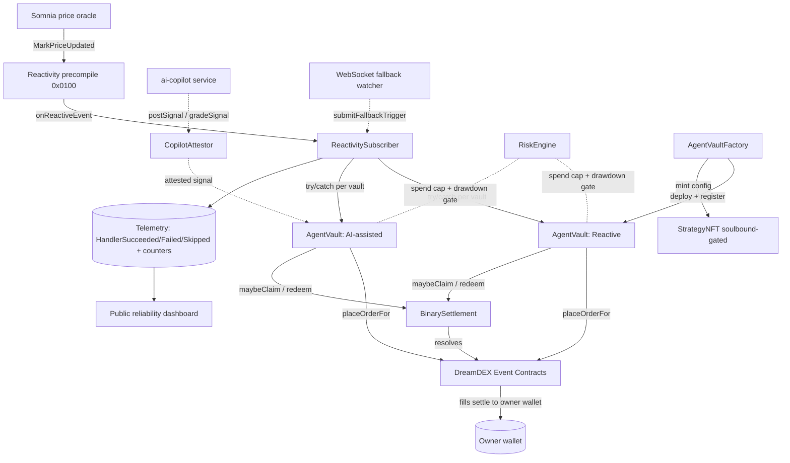

# Candence — Architecture

## The reactive thesis (why this exists)

Event Contracts today are single-shot and single-player: a human watches a price, forms a view, and places one order per window. Candence turns that into a continuously-running, publicly-measurable **agent arena** whose defining property is that **the decision is triggered onchain, by Somnia's Reactivity precompile (`0x0100`), not by an offchain cron.**

That distinction is the whole project. An offchain poller that "reacts within a second" is architecturally identical to every trading bot ever written; it just happens to be fast. A contract that *subscribes to a price event and is invoked by the chain itself* is a different claim entirely — and it is verifiable on the explorer, block by block. So the non-negotiable rule throughout the codebase is: **the reactive path is never bypassed to make a demo smoother.** Reliability is fixed *at* the reactive layer (handler isolation, SOMI funding, a fallback watcher that itself submits an onchain trigger), never by quietly reintroducing a poller on the decision path.

## System diagram

## Operator model, not custody (§1.6)

DreamDEX's real primitive is an **operator model**, and Candence is built directly on it rather than on a fund-holding vault. A user signs one approval in the `OperatorPermissionsRegistry` that authorizes an `AgentVault` to call `placeOrderFor` / `cancelOrderFor` / `reduceOrderFor` **on their own wallet**. The operator never touches funds; deposits and withdrawals remain owner-only; every fill settles directly to the owner's wallet. Authorization is per-selector and **revocable immediately**.

This is a strictly stronger non-custodial story than "the vault holds delegated funds," and it changes what the vault contract is responsible for: **it enforces spend limits and strategy logic, not custody.** The registry does not enforce spend caps — Candence's `RiskEngine` does, onchain.

## Components

### ReactivitySubscriber.sol
Subscribes to the price event via `0x0100`, following the `SpotStopOrderRegistry` pattern. Its `onReactiveEvent` callback iterates the registered vaults with **per-vault `try/catch`** so one failing handler never blocks the others in the same block. Every invocation outcome emits exactly one structured event — `HandlerSucceeded(vault, marketKey, latencyMs, block)`, `HandlerFailed(vault, marketKey, reason)`, or `HandlerSkipped(vault, marketKey, reason)` — and increments a matching **onchain counter** (`succeededCount` / `failedCount` / `skippedCount`, plus `fallbackActivations`). Those counters are a drift-free cross-check for the dashboard: events give the timeline, counters give the invariant total. Admin actions (price source, unpause) are **timelocked**; only `pause()` is instant (freezing is safe, unfreezing is not).

### AgentVault.sol
One vault per strategy instance, registered as an operator for one or more owner wallets. On a reactive callback it: (1) re-reads the target market's **live onchain status** and gates on `Trading(1)` (never trusts an indexer), (2) evaluates its strategy, (3) snaps price to the tick grid and size to the lot grid **as bigints** (never float `toFixed` — that reverts `InvalidPrice`), (4) sets a mandatory `expireTimestampNs` just past the requote interval, and (5) calls `placeOrderFor` for each owner. Two immutable modes:

- **Reactive** — decision computed purely from onchain-readable state (EMA over recent marks, streak-adjusted Kelly-lite sizing from the vault's own settlement history, keyed by `marketId`/symbol, never pool address).
- **AI-assisted** — reads an attested signal from `CopilotAttestor` as one additional weighted input, with a **mandatory fallback** to reactive rules if no valid signal exists for the current window at trigger time. The fallback emits `FellBackToReactive(marketKey, reason)` — it is logged, never hidden.

### RiskEngine.sol
Onchain, contract-enforced: per-owner spend caps (the thing that actually gates `placeOrderFor`), a per-vault max-drawdown circuit breaker that auto-pauses a vault when realized losses cross a threshold, position-size caps tied to realized win-rate computed from the vault's own settlement history, and a global emergency pause. Parameter changes are timelocked. **Void = break-even** (both sides redeem 0.5), recorded as neither win nor loss — getting this wrong would corrupt every win-rate number downstream.

### StrategyNFT.sol
ERC-721 representing the *strategy configuration* (not capital), minted to the original deployer — cloning grants operator access, it does not mint a new NFT. **Transfer is gated to a curated allowlist** during the hackathon; there is deliberately no open secondary market (scope boundary §8).

### CopilotAttestor.sol
Onchain registry of AI signals: `postSignal(windowKey, scoreBps, confidenceBps, issuedAt, signature)` and, after resolution, `gradeSignal(windowKey, correct)`. This makes "signal quality" a first-class, auditable dashboard metric rather than a self-reported footnote.

## Claim / Settlement sweeper (§4.6 — mandatory, not cleanup)

Winnings on Event Contracts are **claimed, not auto-converted**. A vault that never redeems looks increasingly idle while capital is stranded across dozens of finalized markets. So each `AgentVault` runs a claim sweep **inside its own operator loop on the same key/nonce sequence as trading** (to avoid nonce races): on a fixed candence it discovers finalized markets via `listBinaryMarkets({ venueId, status: "Finalized" })` — `loadMarkets()` alone skips finalized binaries — and redeems each claimable position with an **explicit outcome index**. Voids redeem both sides at 0.5 and are booked as break-even. Each claim emits `ClaimSwept(marketKey, outcome, amount, voided)`, and the dashboard surfaces **"unclaimed winnings outstanding"** as a leading indicator that the sweeper has stalled.

## SOMI / gas economics (§4.3)

The subscriber's reactive handler is paid for out of the contract's native SOMI balance. Somnia requires **≥ 32 SOMI at subscription creation**; every invocation draws gas from that native balance. Candence treats this as a first-class operational concern, not an afterthought:

- **Readout** — `subscriberBalance()` on the subscriber is surfaced live on the dashboard, alongside a computed burn rate (SOMI spent per window × windows/day).
- **Alert** — a low-balance threshold lights a visible alert on the dashboard well before exhaustion.
- **Top-up** — The `ReactivitySubscriber` contract implements a `receive() external payable {}` fallback, so anyone (or an automated keeper) can extend runway by sending STT/SOMI directly to its address. There is no custom `fundGas()` escrow.
- **Exhaustion behavior** — on insufficient gas the handler **skips the window and emits `HandlerSkipped`**. It never reverts silently and never bricks. A skip is a recorded, explainable event, not a mystery gap.

**Economics, concretely.** At the 15-minute candence there are 96 windows/day per interval. If a handler invocation costs *g* SOMI, daily burn per subscribed asset is `96 × g` (plus the 1-hour windows). A 32-SOMI floor therefore buys a predictable number of days of runway that the dashboard displays directly, so funding is a planned line item rather than an outage waiting to happen. On mainnet this same model carries over unchanged (addresses are identical via CREATE3); only the token decimals and venue id differ.

## WebSocket fallback watcher (§4.5)

An offchain service listens on the DreamDEX public WS **purely as failover**. If it observes a price update that the reactive subscriber should have handled but didn't (no `HandlerSucceeded` for that market within a short window), it submits a **catch-up trigger transaction** via `submitFallbackTrigger` — i.e. it repairs the reactive layer from the outside rather than replacing it. This is explicitly **not** the decision path. Every activation increments the onchain `fallbackActivations` counter and is surfaced on the dashboard as a **distinct** "fallback trigger" count. A run that shows the fallback cleanly catching a handful of real misses is a *stronger* reliability story than one claiming zero — it is the demo's proof point.

## Telemetry → dashboard data flow

Every meaningful state change emits a structured onchain event, and the important totals are also onchain counters. The dashboard reads **directly from these events/reads** (with an optional Supabase layer as a *labeled* cache for fast historical aggregation, never as source of truth). Each number on the dashboard names its own provenance ("last 24h · onchain"), so a judge can reconcile any figure against the explorer. This is what converts "clever demo" into "production infrastructure": the reliability claim is continuously, publicly falsifiable.
